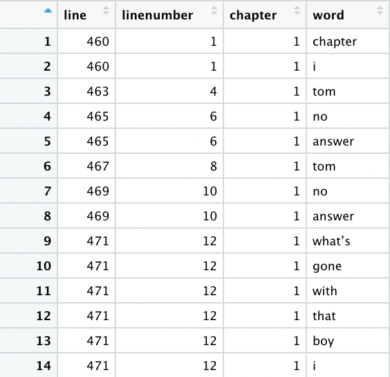

```{r setup, include=FALSE}
knitr::opts_chunk$set(echo = TRUE)
```

```{r, echo=FALSE, message=FALSE, warning=FALSE}
source("Tom_Sawyer.R", echo = FALSE)
```


<center> 

{width=70%} 

# Data Preparation

In the initial steps of this analysis I did some cleaning of the book file in order to make easier to work with. After reading in the book from Gutenberger, I manually removed the table of contents, along with any stop words throughout. My next step was to create a chapter indicator in order to do a sequential analysis of Tom Sawyer. This left me with a result that looked like the following.


<center>

{width=30%} 

</center>
# Most Commonly Used Words

From the plot below, one can see that the most commonly used words are "Tom" and "Huck". This indicates that these two characters are two of the main characters in the book. This is not all too surprising considering the name of the book.

```{r, echo=FALSE, message=FALSE, warning=FALSE, fig.align='center', fig.height=4, fig.width = 6}
ggplot(data =head(tidytext,10)) + geom_bar(mapping = aes(x = word, y = n), stat = "identity", fill= "cornflowerblue") +  ylab("Frequency") + xlab("Word") + ggtitle("The Adventures of Tom Sawyer") +  theme(panel.grid.major = element_blank(), panel.grid.minor = element_blank(),panel.background = element_blank())

```


# Sentiment Analysis

The following plots show the sentiment of The Adventures of Tom Sawyer using two different lexicons, Bing and Afinn.  The analysis is done at a chapter level. As one can see the two lexicons do not behave identically. The AFINN lexicon picks up on more fluctuations in the sentiment throughout the book than the BING lexicon does. However, looking at both of these analysis it is hard glean any real knowledge about what is going on in the book. We can potentially see where is conflict or something negative going on, but it does not help up to understand a more detailed level of the plot line.


```{r, echo=FALSE, message=FALSE, warning=FALSE, fig.align='center',}
require(gridExtra)
grid.arrange(BING_Plot, AFINN_Plot, nrow = 2)
```

