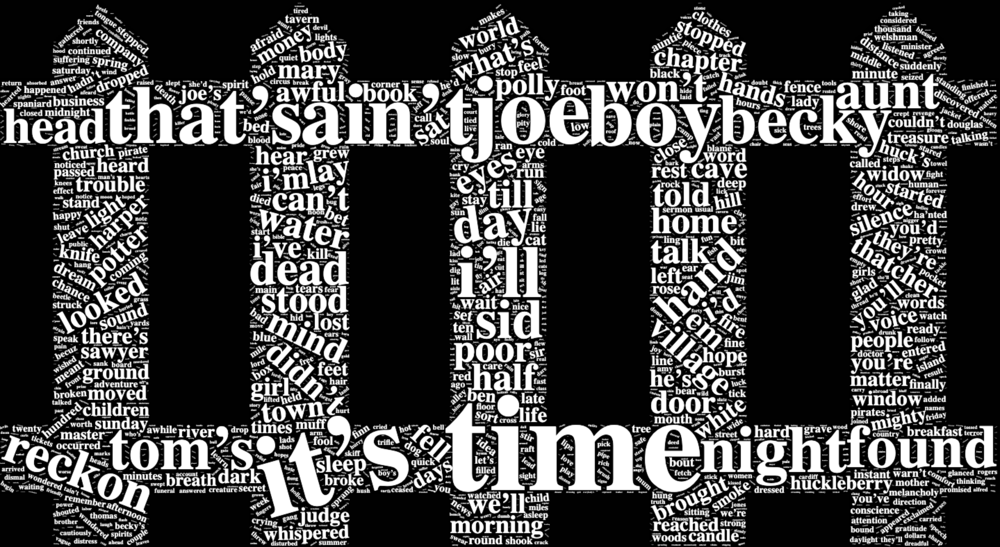

```{r setup, include=FALSE}
knitr::opts_chunk$set(echo = TRUE)
```

```{r, echo=FALSE, message=FALSE, warning=FALSE}
source("Tom_Sawyer.R", echo = FALSE)
```


<center> 
{width=70%} 


# Sentimentr Analysis Plot Analysis

The below plot tracks the overall sentiment of the book broken out by chapter. Each plot is a different chapter, with each point representing a different paragraph within that chapter. The color of the points fades to a light blue as the sentiment becomes higher. In comparison to part one of this assignment, where we only have the chapter level information, here we are able to take a much more detailed look into what is happening within each chapter. This more granualar view, helps to dig deeping into what is going on in this book.

```{r, fig.align='center', fig.height=8, fig.width=6, echo=FALSE, message=FALSE, warning=FALSE, }
sentimentr_overall_book_pot
```

\newpage

# Sentimentr Character Analysis

The below plot is a plot of the characters in the book along with the average sentiment associated with them. This plot clearly shows that Huck, Joe, and Tom appear the most in this book. This is very much in line with the true plot of this book.

```{r, fig.align='center', fig.height=8, fig.width=8, echo=FALSE, message=FALSE, warning=FALSE, }
Character_Analysis_plot

```

\newpage

# Analysis of Tom and Huck

Below is a plot of the interaction of the sentiment between Tom and Huck throughout the book. Each plot is a different chapter, with each point representing a different paragraph within that chapter. The black horizontal line running through the book indicates the average sentiment of the entire book. By using this line, one can see portions of the book where the sentiment around Tom and or Huck may be above or below average. This leads to the question of what is going on in the book within a certain chapter, and are those events reflected in the sentiment identified around these two characters.

For example, when looking at chapter 20 one might notice that the sentiment around Tom is lower than the overall book average. From a quick synopsis of this chapter, one can quickly learn that in this chapter Tom had taken the blame for a problem that had occurred at school and was reprimanded for this act. This is reflected clearly in the sentiment analysis of this chapter. Though we might not know exactly what is going on context wise, we can deduce that Tom may not have been viewed in the best light during this chapter of the book.

```{r, fig.align='center', fig.height=8, fig.width=10, echo=FALSE, message=FALSE, warning=FALSE, }
Character_Analysis_TOM_HUCK_CP_plot
```


